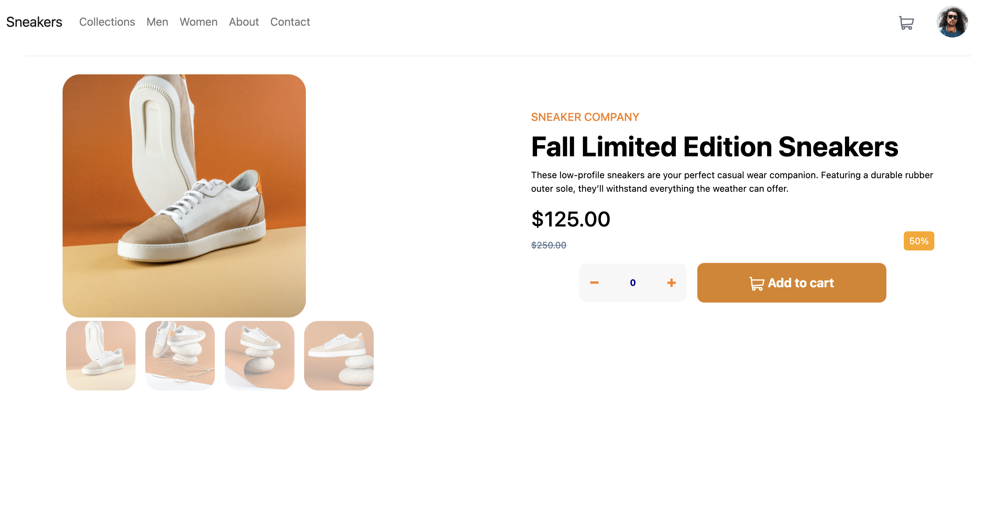

# Frontend Mentor - E-commerce product page

## Welcome! 👋

### The challenge

Users should be able to:

- View the optimal layout for the site depending on their device's screen size
- See hover states for all interactive elements on the page
- Open a lightbox gallery by clicking on the large product image
- Switch the large product image by clicking on the small thumbnail images
- Add items to the cart
- View the cart and remove items from it
✨✨✨

## My process

### Built with

- Semantic HTML5 markup
- CSS custom properties
- Bootstrap 4
- Flexbox
- CSS Grid
- Mobile-first workflow
- JavaScript

### What I will edit and perfect more soon (continued development) 

- lightbox and modals
- responsiveness

## Author

- Credits - Dalal Aljassem 🍉🍉
